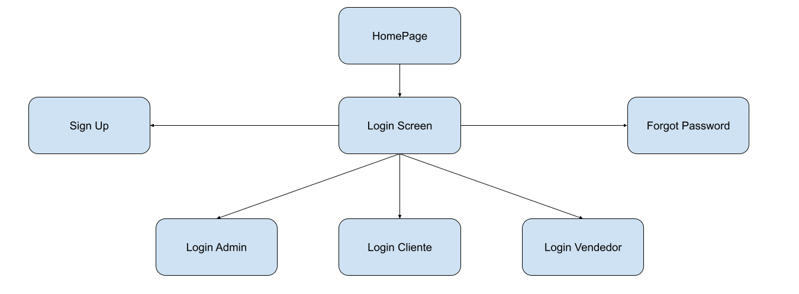
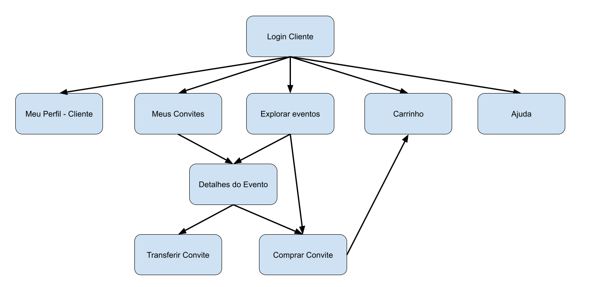
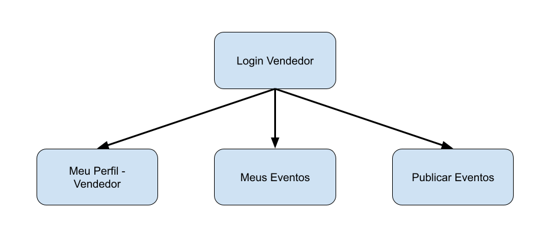
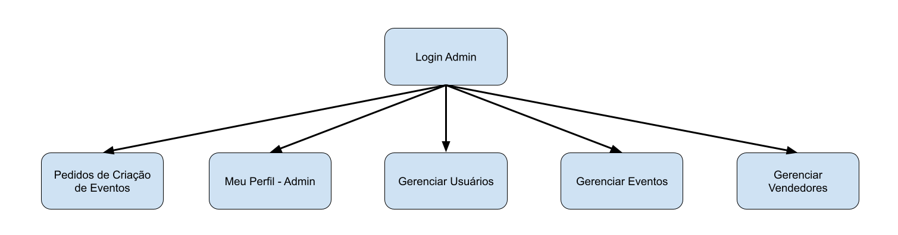

# Tik.me

> Web Project of an online store aimed at selling event tickets. Project developed for the Introduction to Web Development subject (SCC0219) of the Computer Science bachelor course at ICMC/USP.

## Group #17

- Eduardo Rodrigues Amaral - 11735021
- Vítor Beneti Martins - 11877635
- Leonardo Chagas Pizzo - 10288511

## 1. Requirements:

- The system must have 3 types of users: Clients, Event Administrators (Sellers) and Super Admins.

- Super Admins are responsible for registering/managing super admins, event administrators, customers, and events. The application already comes with a super admin account admin with password admin.

- Event Administrators are responsible for registering events and managing events created by them.

- Customers are users who access the system to buy event tickets.

- The super admin record includes, at least: name, id, phone, email.

- Each event admin record includes, at least: name, id, phone, email, address, CPF/CNPJ, banking info and photo.

- Each customer's record includes, at least: name, id, phone, email, CPF, birth date and photo.

- Event records include, at least: name, id, photo, description, price, quantity (in stock), quantity sold, location, date, attractions and age limit.

- Selling Event Tickets: Events are selected, their quantity chosen, and are included in a cart. Tickets are purchased using a credit card number (any number is accepted by the system). The quantity of ticket sold is subtracted from the quantity in stock and added to the quantity sold. Carts are emptied only on payment or by customers.

- Event Management: Event Administrators can create/update/read/delete (crud) new events. For example, they can change the stock quantity.

- Customers must be able to transfer ticket between accounts (Specific Functionality).

- The system must provide accessibility requirements and provide good usability.

- The system must be responsive.

## 2. Project Description:

**Tik.me** is a web application that allows users to find and buy tickets for events, besides that users can exchange tickets between accounts. Event Administrators can create and manage their events. Super Admins can create and manage other users and any events.

The system will be developed using Next.js and MongoDB.

To the moment the system is still in development and is not fully functional. What is available are mockups of the application made using Figma and three incipient mockup pages built with Next.js.

### 2.1 System Mockups:

The three main mockups made with Next.js are available at [tik-me-tmp.vercel.app](https://tik-me-tmp.vercel.app/). Source Code for them can be found at the root of the repository.

The remaining system mockups are available at [Figma](https://www.figma.com/file/e6l1Ek7bTZZzTFtO5qVqpu/Ticket-Mart)

### 2.2 Navigation Diagram:

#### 2.2.1 Login Diagram:



#### 2.2.2 Customer Diagram:



#### 2.2.3 Event Admin Diagram:



#### 2.2.4 Super Admin Diagram:



### 2.3 System Functionalities:

#### 2.3.1 Super Admin Functionalities:

- Manage Event Administrators
- Manage Customers
- Manage Events
- Manage Super Admins
- Change Profile Info
- Change Password
- Login
- Logout

#### 2.3.2 Event Administrator Functionalities:

- Create Event
- Update Event
- Read Event
- Delete Event
- Change Profile Info
- Change Password
- Login
- Logout

#### 2.3.3 Customer Functionalities:

- Search Events
- Add Event to Cart
- Remove Event from Cart
- Transfer Ticket
- Checkout
- Change Profile Info
- Change Password
- Create Account
- Login
- Logout

### 2.4 Information Saved by the System:

#### 2.4.1 Super Admin Information:

- Name
- ID
- Phone
- Email

#### 2.4.2 Event Administrator Information:

- Name
- ID
- Phone
- Email
- Address
- CPF/CNPJ
- Banking Info
- Photo

#### 2.4.3 Customer Information:

- Name
- ID
- Phone
- Email
- CPF
- Photo
- Birth Date

#### 2.4.4 Event Information:

- Name
- ID
- Photo
- Description
- Price
- Quantity in Stock
- Quantity Sold
- Location
- Date
- Attractions
- Age Limit

#### 2.4.5 Purchase Information:

- Cart Snapshot
- ID
- Date
- Total Price
- Customer
- Number of Tickets
- Tickets

#### 2.4.6 Transfer Information:

- ID
- Source Account
- Destination Account
- Ticket ID

#### 2.4.7 Ticket Information:

- ID
- Event
- Customer

## 3. Comments About the Code:

Source code to the three mockup pages is available at the root of the repository.

The pages are available at the folder `pages`.
The Header component is available at the folder `components`.
The styles are available at the folder `styles`.

## 4. Test Plan:

For the first milestone, no tests were made. In the future tests will be made to ensure the system is working properly.

## 5. Test Results:

No tests results available.

## 6. Build Procedures:

To build the project, run the following commands:

```
npm install
npm run build
```

To run the project in development mode, run the following commands:

```
npm install
npm run dev
```

## 7. Problems:

No major problems found in the first milestone.

## 8. Comments:

No comments for the first milestone.

## 9. Reviews:

As part of this project the group has to peer-review another group's work after each milestone.  

Review 1 - Group 24: https://docs.google.com/document/d/1J8ZI91HjP8c0YY5oTa11FD-RqorYXFPoMAepZjZfodc/edit?usp=sharing
Review 2 - https://docs.google.com/document/d/1GAFoPBWE2-Xz77N8IMBggatpk-W1NkyVBVKCALA6nwk/edit?usp=sharing
